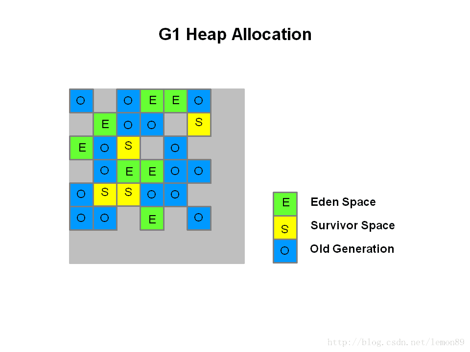

### GC Root
1. 虚拟机栈中引用的对象
2. 本地方法栈中JNI引用的对象
3. 方法区中静态成员变量引用的对象
4. 方法区中常亮引用的对象
 ### Reference
1. 强引用。 只要强引用存在，被引用的对象就不会被回收
2. 软引用：在系统将要发生内存溢出时，会把这些对象列入回收范围，进行二次回收
3. 弱引用：只能生存到下一次垃圾回收之前
4. 虚引用：不对关联的对象生存时间构成影响，也无法获取对象实例，它唯一的最用是对抗被GC回收收到一条系统通知
### JVM 常见的GC算法
1. 标记-清除算法：该算法一次回收分为两个阶段：标记、清除。首先标记所有需要回收的对象，在标记完成后回收所有标记的对象。这种算法会产生大量不连续的内存碎片，当要频繁分配一个大对象时，JVM在新生代中找不到足够大的连续内存时，会导致频繁内存回收
2. 复制算法：这种算法会将内存划分为两个相等的块，每次只要使用其中一块。当内存不够时，就将还存活的对象复制到另一块内存中，然后把这块内存一次清理掉
3. 标记-整理算法：这是标记-清除算法的升级版。在完成标记后，不是直接对可回收对象进行清理，而是让存活的对象向一段移动，然后清理掉边界以外的内存
4. 分代收集算法：当前商业虚拟机都采用这种算法。首先根据对象存活周期不同将内存分为几块即：新生代，老年代，然后根据不同年代特点，采用不同的收集算法，新生代采用复制算法，老年代采用标记整理
### GC：
   |参数|回收区域|触发条件|
   | :--------   | :-----  |:-----  |
   |Minor GC|新生代|当新生对象生成，并且在Eden区申请空间失败时触发Minor GC|
   |Full GC | 整个堆，包括Yong,Tenured和Perm|老年代（Tenured)空间不足，持久代空间不足，System.gc(),上一次GC之后heap的各个区域分配策略动态变化|
###### 常见的GC回收器：
   

###### Serial与Serial Old 收集器

Serial，翻译成中文的意思是“串行”，顾名思义，这就是个单线程的收集器。仅仅使用一个线程去执行垃圾收集任务，而且收集任务期间，必须停掉其他的工作线程，直到垃圾收集完成。垃圾回收时停掉其他的线程的现象，就称为“Stop The World(STW)”。打个比方，我清扫房间的时候，任何人都不能在家里活动，以免给我捣乱，不然清扫工作怎么也没法做完。STW就是这么个意思，至于暂停应用多久，得看具体垃圾的情况了。 

###### ParNew 收集器

ParNew其实就是Serial的多线程版本，在新生代中使用多条线程进行垃圾回收。

###### Parallel Scavenge 收集器

 Parallel Scavenge 收集器也是新生代收集器，也是使用复制算法的多线程收集器。 

 Parallel Scavenge最大的特点是更关注吞吐量。 

吞吐量就是CPU用于运行用户代码的时间与CPU总消耗时间的比值：
吞吐量 = 运行用户代码时间 / (运行用户代码时间) + 垃圾收集时间
打个比方，虚拟机运行了100分钟，垃圾回收用了2分钟，那么吞吐量就是98%。 

按照公式来看，吞吐量越高的虚拟机，自然是垃圾收集时间也越短，理所当然的用户体验也要更好。Parallel Scavenge收集器会根据当前系统的运行情况，动态调整某些参数来提供最合适的停顿时间或最大的吞吐量，这就是GC的自适应调节策略，这也是其与ParNew收集器最明显的区别。
###### Parallel Old 收集器

Parallel Old 是 Parallel Scavenge收集器的老年代版本，运用多线程和标记整理算法收集。从最上面的搭配图也可以看到，Parallel Old 只能与Parallel Scavenge配对使用

###### CMS 收集器

CMS收集器是一种以获取最短回收停顿时间为目标的收集器。在B/S架构模型的网站上，运用CMS收集器十分广泛，因为网站上更希望停顿越短越好，用户体验才能更好。 

CMS收集器是基于标记清除算法实现的，但是其运行过程相对来说更复杂了，整个过程分成下图4个步骤： 

|步骤|操作|说明|
|---- |:------- |:--- |
 |1|初始标记|在图中可以看出这个步骤是单线程处理的，并且用户线程并未运行，是因为出现了STW。这个过程只是标记一下GC Roots能直接关联到的对象，速度很快。|
 |2|并发标记 |标记从初始化标记对象可达的存活对象。|
 |3| 重新标记|重新标记阶段是为了修正并发标记期间，因用户线程继续运行导致标记产生变动的那一部分对象的标记。看起来有点绕，其实意思就是在并发标记时，用户线程也会产生需要标记的对象，这部分对象不能漏了标记，所以就需要重新标记过程。在图中可以看到，没有用户线程在运行，说明需要STW|
 |4| 并发清除|并发清除这个阶段看图也能类比了，有GC线程与用户线程并发运行，GC线程清理掉那些标记的对象，用户线程正常运行|

第一，第三步的初始标记(Initial Mark)和重新标记(Remark)依然会引发STW
整体来看，CMS收集器的垃圾回收过程是与用户线程一起并发执行的。 

但是CMS收集器还是有一下三个缺点：
   1. 因为是使用并发收集，虽然不会导致用户线程停顿，但是会占用一部分线程而导致应用程序变慢，总的吞吐量会降低。
   2. CMS收集器无法处理浮动垃圾，可能出现“Concurrent Mode Failure”失败而导致另一次Full GC的发生。因为在并发清理阶段，用户线程还在运行，自然就还有新的垃圾不断产生，这部分垃圾出现在标记过程之后，CMS也束手无策，只能等待下次GC时再清理，这一部分垃圾就叫“浮动垃圾”。
   3. CMS是基于标记清除算法实现的，标记清除算法的缺点，就是会产生大量的空间碎片。空间碎片过多时，就会给大对象的空间分配带来麻烦。比如老年代有足够的空间，但是找不到连续的足够大的空间，而不得不触发一次Full GC。为了解决这个问题，CMS收集器提供了-XX:+UseCMSFullGCsBeforeCompaction参数，用于设置执行了多少次不压缩的FGC后来一次碎片整理（默认是0，每次进入FGC时都进行碎片整理）。
   
   ###### promotion failed和concurrent mode failure
   |参数|说明|
   | :--------   | :-----  |
   | promotion failed|该问题是在进行Minor GC时，Survivor Space放不下，对象只能放入老年代，而此时老年代也放不下造成的。（promotion failed时老年代CMS还没有机会进行回收，又放不下转移到老年代的对象，因此会出现下一个问题concurrent mode failure，需要stop-the-wold 降级为GC-Serail Old）。|
   |concurrent mode failure|该问题是在执行CMS GC的过程中同时业务线程将对象放入老年代，而此时老年代空间不足，或者在做Minor GC的时候，新生代Survivor空间放不下，需要放入老年代，而老年代也放不下而产生的。|
   
   
   ###### CMS 调优参数
   |参数|说明|
   | --------   | :-----  |
  |XX:+UseConcMarkSweepGC|使用CMS |
|-XX:+CMSParallelRemarkEnabled |表示cms的remark阶段采用并行的方式|
|-XX:+UseCMSCompactAtFullCollection |在进行Full GC时对内存进行压缩|
|-XX:+UseCMSInitiatingOccupancyOnly |表示cms gc只基于参数CMSInitiatingOccupancyFraction触发|
|-XX:CMSInitiatingOccupancyFraction=75 |手动指定当老年代已用空间达到75%时，触发老年代回收(默认92%)|
|-XX:CMSFullGCsBeforeCompaction=2  |标识着每经过多少次Full GC 触发对内存进行一次压缩，默认是0次
##### G1 Garbage Collector

heap被划分为一个个相等的不连续的内存区域（regions）,每个region都有一个分代的角色:eden、survivor、old（old还有一种细分 humongous，用来存放大小超过 region 50%以上的巨型对象）

G1里面的Region的概念不同于传统的垃圾回收算法中的分区的概念。G1默认把堆内存分为1024个分区，后续垃圾收集的单位都是以Region为单位的。Region是实现G1算法的基础，每个Region的大小相等，通过-XX:G1HeapRegionSize参数可以设置Region的大小
###### G1 回收过程
####### G1 Young GC(STW)
1. 当eden数据满了,则触发g1 YGC 
2. 并行的执行： 
YGC 将 eden region 中存活的对象拷贝到survivor,或者直接晋升到Old Region中；将Survivor Regin中存活的对象拷贝到新的Survivor或者晋升old region。 
3. 计算下一次YGC eden、Survivor的尺寸

####### G1 Mix GC

|步骤|操作|说明|
| --------   | :-----  | : --------   | 
|1|初始标记（initial mark，STW）| G1 GC 对GC Root直接引用对象进行标记|
|2|并发标记（Concurrent Marking| G1 GC 在整个堆中查找可访问的（存活的）对象。该阶段与应用程序同时运行，可以被 STW 年轻代垃圾回收中断|
|3|最终标记（Remark，STW） |该阶段是 STW 回收，帮助完成标记周期。G1 GC 清空 SATB 缓冲区，跟踪未被访问的存活对象，并执行引用处理。|
|4|清除垃圾（Cleanup，STW）| 在这个最后阶段，G1 GC 执行统计和 RSet 净化的 STW 操作。在统计期间，G1 GC 会识别完全空闲的区域和可供进行混合垃圾回收的区域。清理阶段在将空白区域重置并返回到空闲列表时为部分并发。|

###### G1与CMS不同点

   |参数|说明|
   | :--------   | :-----  |
   |回收算法不同|CMS使用标记清除，G1使用复制算法；内存管理不需要使用空闲列表|
   |作用区域不同|CMS 只能用于老年代，G1 既可以用于老年代也可以用于新生代|
   |额外空间要求不同|CMS需要额外空间处理浮动垃圾，G1不需要|
   
   ###### G1常用参数
   |参数|含义|默认值|
   | :--------   | :-----  | :-----  |
   |-XX:+UseG1GC|	使用 G1 垃圾收集器||
   |-XX:MaxGCPauseMillis=200|	设置期望达到的最大GC停顿时间指标（JVM会尽力实现，但不保证达到）||
   |-XX:InitiatingHeapOccupancyPercent=45|	启动并发GC周期时的堆内存占用百分比. G1之类的垃圾收集器用它来触发并发GC周期,基于整个堆的使用率,而不只是某一代内存的使用比. 值为 0 则表示”一直执行GC循环”.| 默认值为 45|
   |-XX:NewRatio=n|	新生代与老生代(new/old generation)的大小比例(Ratio)| 默认值为 2|
   |-XX:SurvivorRatio=n|	eden/survivor 空间大小的比例(Ratio)| 默认值为 8|
   |-XX:MaxTenuringThreshold=n|	提升年老代的最大临界值(tenuring threshold)| 默认值为 15|
   |-XX:ParallelGCThreads=n|	设置垃圾收集器在并行阶段使用的线程数|默认值随JVM运行的平台不同而不同|
   |-XX:ConcGCThreads=n|	并发垃圾收集器使用的线程数量| 默认值随JVM运行的平台不同而不同|
   |-XX:G1ReservePercent=n|	设置堆内存保留为假天花板的总量,以降低提升失败的可能性| 默认值是 10|
   |-XX:G1HeapRegionSize=n|	使用G1时Java堆会被分为大小统一的的区(region)。此参数可以指定每个heap区的大小| 默认值将根据 heap size 算出最优解. 最小值为 1Mb, 最大值为 32Mb|
