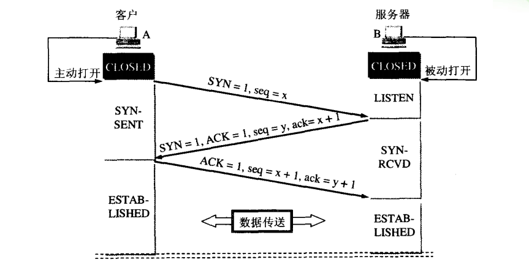
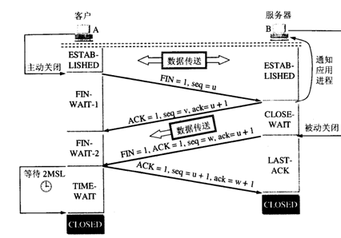

### 整个SSL/TLS握手阶段一共有4次通信：

1. 客户端发出请求（ClientHello）

首先，客户端先向服务器发出加密通信的请求，并向服务器提供以下信息：

支持的协议版本，如TLS 1.0
一个客户端生成的随机数，稍后用于生成对话密钥
支持的加密方法，如RSA公钥加密
支持的压缩方法
2. 服务器回应（ServerHello）

确认加密通信协议版本。如果浏览器与服务器支持的版本不一致，则服务器关闭加密通信
一个服务器生成的随机数，稍后用于生成对话密钥
确认加密方法
服务器证书
此处，如果服务器需要确认客户端的身份，如金融机构需要客户提供USB密钥（U盾），就会向客户端请求证书。

3. 客户端回应

一个随机数，稍后用于生成对话密钥，并且只用服务器的公钥加密，防止被窃听
编码改变通知，表示随后的信息都将用双方商定的加密方法和密钥发送
客户端握手结束通知，表示客户端的握手阶段已经结束。这一项同时也是前面发送的所有内容的hash值，用来供服务器校验
如果前一步要求了客户端证书，则会发送证书及相关信息。

4. 服务器回应

编码改变通知，表示随后的信息都将用双方商定的加密方法和密钥发送
服务器握手结束通知，表示服务器的握手阶段已经结束。这一项同时也是前面发送的所有内容的hash值，用来供客户端校验

### 总结
SSL/TLS握手阶段的所有通信都是明文传输的（除了随机数3）：

+ 客户端->服务器：随机数1，支持的协议，支持的加密方法
+ 服务器->客户端：随机数2，确认协议和加密方法，证书
+ 客户端->服务器：随机数3（加密），编码通知
+ 服务器->客户端：编码通知

以后的所有通话都通过3个随机数生成的一个session key来进行加解密（由于随机数3中间人得不到，所以破解不了）

 
  
  
  ##三次握手建立连接时，发送方再次发送确认的必要性？
  主 要是为了防止已失效的连接请求报文段突然又传到了B,因而产生错误。假定出现一种异常情况，即A发出的第一个连接请求报文段并没有丢失，而是在某些网络结 点长时间滞留了，一直延迟到连接释放以后的某个时间才到达B，本来这是一个早已失效的报文段。但B收到此失效的连接请求报文段后，就误认为是A又发出一次 新的连接请求，于是就向A发出确认报文段，同意建立连接。假定不采用三次握手，那么只要B发出确认，新的连接就建立了，这样一直等待A发来数据，B的许多 资源就这样白白浪费了。
  ## 四次挥手释放连接时，等待2MSL的意义？
  第 一，为了保证A发送的最有一个ACK报文段能够到达B。这个ACK报文段有可能丢失，因而使处在LAST-ACK状态的B收不到对已发送的FIN和ACK 报文段的确认。B会超时重传这个FIN和ACK报文段，而A就能在2MSL时间内收到这个重传的ACK+FIN报文段。接着A重传一次确认。
  第二，就是防止上面提到的已失效的连接请求报文段出现在本连接中，A在发送完最有一个ACK报文段后，再经过2MSL，就可以使本连接持续的时间内所产生的所有报文段都从网络中消失。
