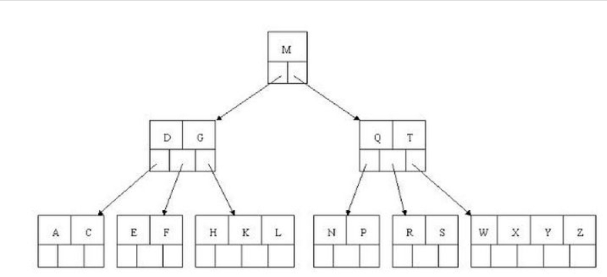
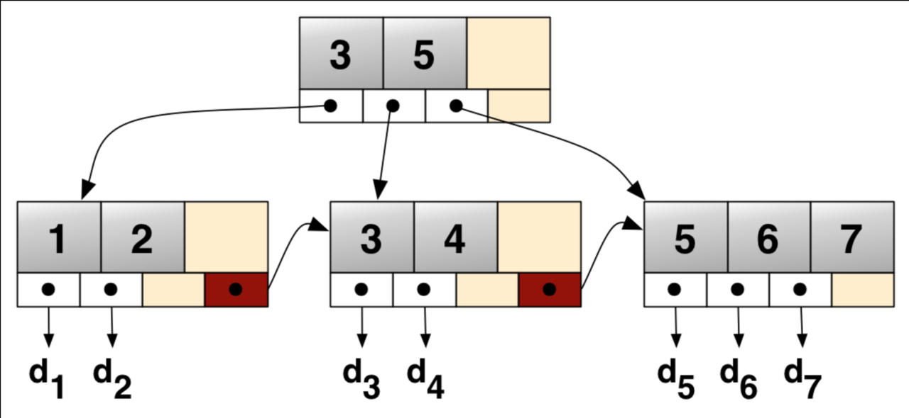
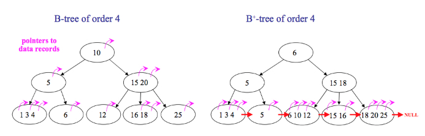
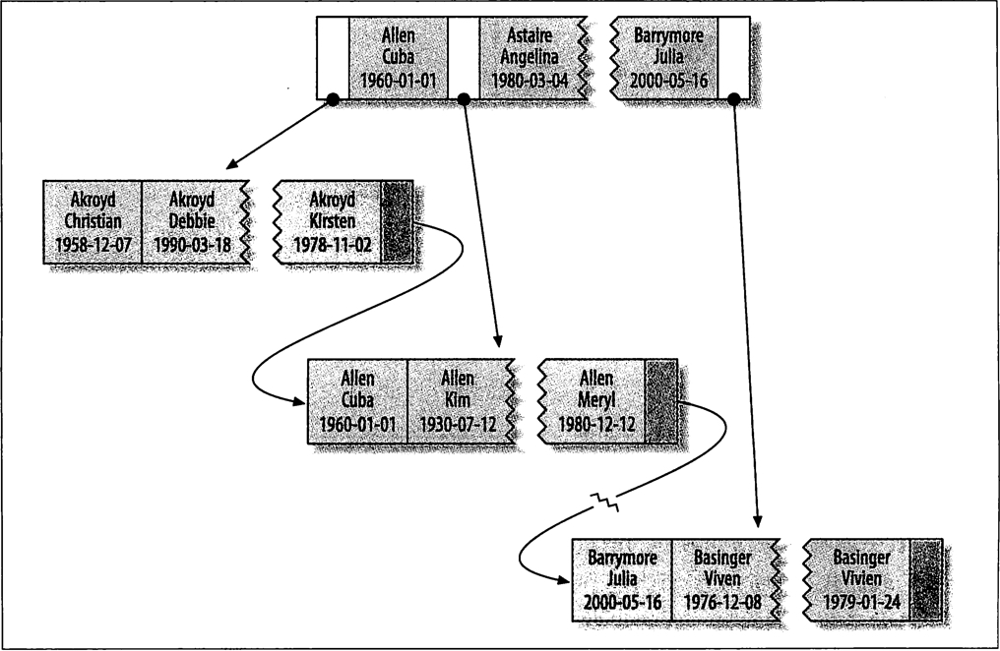
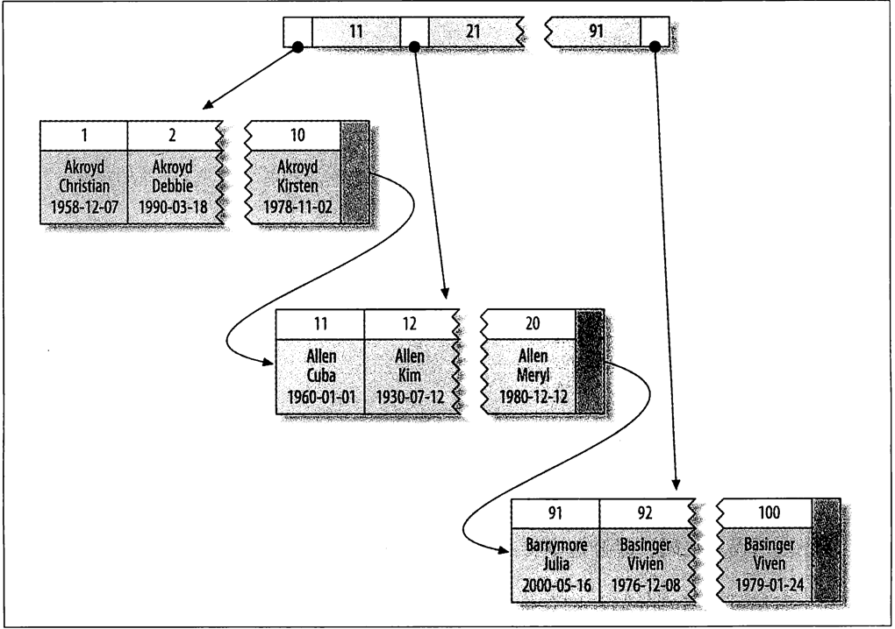

#事物
## ACID
 Atomicity   元子性：一个事物必须视为一个不可分割的最小工作单元，事物中的所有操作要么同时成功要么同时失败
 Consistency 一致性
 Isolation   隔离性：
 Durability  持久性：一旦事物提交，则其所做的修改就会永久保存到数据库中。
 
 ## 隔离级别
  READ UNCOMMITTED (未提交读)
  READ COMMITED （提交读）
  REPEATABLE READ（可重复读）
  SERIALIZABLE（串行读）
  
 ## 脏读，幻读，不可重复读
  ### 脏读
   脏读是指在一个事物中读取到了另一个事物尚未提交到数据。
 ### 幻读
   幻读和不可重复读类似。它发生在一个事物（T1）读取了几行数据，接着另外一个并发事物（T2）插入了几条数据时，在随后
   的查询中，事物T1就会发现多了一些原本不存在的数据记录，就好像发生了幻觉一样，所以成为幻读。
 ### 不可重复读
   不可重复读是指在一个事物（T1）内多次读取同一数据，在这个事物过程中，另外一个事物T2修改了该数据，导致事物T1两次
   读取的记录不一致。
 
 ## MVCC 多版本并发控制
  InnoDB的MVCC 是通过在每行记录后面保存两个隐藏的列来实现的。这两列分别保存了行的创建时间和行的过期时间（或删除时间）。
  当然存储的不是实际的时间值而是系统版本号。每开始一个新事物，系统版本号都会递增。
 ### insert
     记录的版本号即当前事务的版本号
  |id|value|create_version|delete_version|
  |:---:|:---:|:---:|:---:|
  |1|1|1||
### update
     在更新操作的时候，采用的是先标记旧的那行记录为已删除，并且删除版本号是事务版本号，
     然后插入一行新的记录的方式
   |id|value|create_version|delete_version|
   |:---:|:---:|:---:|:---:|
   |1|1|1|2|
   |1|2|2  
### delete
    删除时将当前事物的系统版本号作为删除版本号
   |id|value|create_version|delete_version|
   |:---:|:---:|:---:|:---:|
   |1|2|2|3|  
 ### select
   InnoDB会根据以下两个条件检查每行记录：
   1. InnoDB 只查找版本号小于或等于事物的系统版本号，这样可以确保事物读取到的行要么是在事物开启前已经存在的，要么是
   事物本身插入或修改过的
   2. 行的删除版本号要么未定义，要么大于当前事物版本号，这样可以确保事物读取到的行在事物开始之前未被删除
# 索引
## 索引分类
  + 从存储结构上可以分为：B-Tree,B+Tree,Hash索引，全文索引，T-Tree, R-Tree
  + 从应用层次可以分为：普通索引,唯一索引，符合索引

索引是一种用于快速查询行的数据结构，就像一本书的目录就是一个索引，如果想在一本书中找到某个主题，一般会先找到对应页码。在mysql中，存储引擎用类似的方法使用索引，先在索引中找到对应值，然后根据匹配的索引记录找到对应的行。

我们首先了解一下索引的几种类型和索引的结构。

## 索引类型
### B树
大多数存储引擎都支持B树索引。b树通常意味着所有的值都是按顺序存储的，并且每一个叶子节点到根的距离相同。B树索引能够加快访问数据的速度，因为存储引擎不再需要进行全表扫描来获取数据。下图就是一颗简单的B树。
  

#### B树的查询流程：
如上图我要从找到E字母，查找流程如下：
* （1）获取根节点的关键字进行比较，当前根节点关键字为M，E<M（26个字母顺序），所以往找到指向左边的子节点（二分法规则，左小右大，左边放小于当前节点值的子节点、右边放大于当前节点值的子节点）；
* （2）拿到关键字D和G，D<E<G 所以直接找到D和G中间的节点；
* （3）拿到E和F，因为E=E 所以直接返回关键字和指针信息（如果树结构里面没有包含所要查找的节点则返回null）；
* （4）通过指针信息取出这条记录的所有信息；

B+树
下图为B+树的结构，B+树是B树的升级版，我们可以观察一下，B树和B+树的区别是什么？
  

B+树和B树的区别是：

B树的节点中没有重复元素，B+树有。
B树的中间节点会存储数据指针信息，而B+树只有叶子节点才存储。
B+树的每个叶子节点有一个指针指向下一个节点，把所有的叶子节点串在了一起。
从下图我们可以直观的看到B树和B+树的区别：紫红色的箭头是指向被索引的数据的指针，大红色的箭头即指向下一个叶子节点的指针。


我们假设被索引的列是主键，现在查找主键为5的记录，模拟一下查找的过程：

#### B树：
 在倒数第二层的节点中找到5后，可以立刻拿到指针获取行数据，查找停止。
#### B+树：
 在倒数第二层的节点中找到5后，由于中间节点不存有指针信息，则继续往下查找，在叶子节点中找到5，拿到指针获取行数据，查找停止。

B+树每个父节点的元素都会出现在子节点中，是子节点的最大（或最小）元素。叶子节点存储了被索引列的所有的数据。

那B+树比起B树有什么优点呢？

由于中间节点不存指针，同样大小的磁盘页可以容纳更多的节点元素，树的高度就小。（数据量相同的情况下，B+树比B树更加“矮胖”），查找起来就更快。
B+树每次查找都必须到叶子节点才能获取数据，而B树不一定，B树可以在非叶子节点上获取数据。因此B+树查找的时间更稳定。
B+树的每一个叶子节点都有指向下一个叶子节点的指针，方便范围查询和全表查询：只需要从第一个叶子节点开始顺着指针一直扫描下去即可，而B树则要对树做中序遍历。
了解了B+树的结构之后，我们对一张具体的表做分析：
```sql
create table Student(
    last_name varchar(50) not null, 
    first_name varchar(50) not null, 
    birthday date not null, 
    gender int(2) not null, 
    key(last_name, first_name, birthday)
);
```

对于表中的每一行数据，索引中包含了name，birthday列的值。下图显示了该索引的结构：


索引对多个值进行排序的依据是create table语句中定义索引时列的顺序，即如果名字相同，则根据生日来排序。

B+树的结构决定了这种索引对以下类型的查询有效：

##### 全值匹配
和索引中所有的列进行匹配，例如查找姓名为Cuba Allen，生日为1960-01-01的人。

##### 匹配最左前缀
查找姓为Allen的人，即只用索引的第一列。

##### 匹配列前缀
匹配某一列的值的开头部分，例如查找所有以J开头的姓的人。

##### 匹配范围值
查找姓在Allen和Barrymore之间的人。

##### 精确匹配某一列并范围匹配另外一列
查找姓为Allen，名字是字母K开头的人。即第一列last_name全匹配，第二列first_name范围匹配。

##### 只访问索引的查询
查询只需要访问索引，无需访问数据行。这种索引叫做覆盖索引。

##### 一些限制：

如果不是按照索引的最左列开始查找，无法使用索引。例如上面例子中的索引无法用于查找某个特定生日的人，因为生日不是最左数据列。也不能查找last_name以某个字母结尾的人。
不能跳过索引的列。上述索引无法用于查找last_name为Smith并且某个特定生日的人。如果不指定first_name，则mysql只能使用索引的第一列。
如果查询中有某个列的范围查询，则右边所有的列都无法使用索引优化查找。例如查询WHERE last_name=’Smith’ AND first_name LIKE ‘J%’ AND birthday=‘1996-05-19’，这个查询只能使用索引的前两列。

### 聚集索引（clusterd index）
每个存储引擎为InnoDB的表都有一个特殊的索引，叫聚集索引。聚集索引并不是一种单独的索引类型，而是一种数据存储方式。当表有聚集索引的时候，它的数据行实际上存放在叶子页中。一个表不可能有两个地方存放数据，所以一个表只能有一个聚集索引。
因为是存储引擎负责实现索引，因此不是所有的存储引擎都支持聚集索引。InnoDB表中聚集索引的索引列就是主键，所以聚集索引也叫主键索引。 例如下面这张InnoDB表：

```sql
create table Student(
    id int(11) primary key auto_increment,
    last_name varchar(50) not null, 
    first_name varchar(50) not null, 
    birthday date not null
);
```

聚集索引（主键索引）的结构如下图：


这是一课B+树，它的叶子页包含了行的全部数据，节点页只包含了索引列（即主键）。

二级索引（secondary indexes）
对于InnoDB表，在非主键列的其他列上建的索引就是二级索引（因为聚集索引只有一个）。二级索引可以有0个，1个或者多个。二级索引和聚集索引的区别是什么呢？二级索引的节点页和聚集索引一样，只存被索引列的值，而二级索引的叶子页除了索引列值，还存这一列对应的主键值。

##### 聚集索引的优点：
+ 可以把相关数据保存在一起，例如实现电子邮箱时，根据用户ID来聚集数据，读取少数的数据页就能获取某个用户的全部邮件。
+ 聚集索引将索引和数据保存在同一个B树中，因此从聚集索引中获取数据比在非聚集索引中要快一些。
##### 聚集索引的缺点：
+ 插入速度严重依赖插入顺序。按照主键的顺序插入是加载数据到InnoDB表中速度最快的方式。假如磁盘中的某一个已经存满了，但是新增的行要插入到这一页当中，存储引擎就会把该也分裂成两个页面来容纳该行，这就是一次页分裂操作。页分裂会导致表占用更多的磁盘空间。
+ 更新聚集索引列的代价很高，会强制InnoDB将每个被更新的行移动到新的位置。 用二级索引访问数据需要两个索引查找，不是一次。因为要先从二级索引的叶子节点获得主键值，再根据这主键去聚集索引中查到对应的行，所以需要两次B树查找。
#### 顺序主键的策略：
在InnoDB表中使用自增主键是既简单性能又高的策略，这样可以保证数据按顺序写入。最好避免随机的聚集索引，从性能的角度考虑，使用UUID来作为聚集索引是很糟糕的，这样不仅插入行花费的时间长，而且索引占用的空间也更大。

  
## 哈希索引
  哈希索引（Hash Index)基于哈希表实现，只能精确匹配索引所有列才能有效。对于每一行数据，存储引擎都会对所有索引
  列计算哈希值，哈希索引将所有哈希值保存在哈希表中，同时哈希表中保存指向数据行对指针
### 哈希索引限制
   1. 哈希索引只包含哈希值和行指针，而不存储字段，所以不能使用索引中对值来避免读取行
   2. 哈希索引数据并不是按索引值顺序存储的，所以无法使用排序
   3. 哈希索引不支持部分索引列匹配查找
   4. 哈希索引只支持等值查询
   5. 如果哈希冲突很多的话，一些索引维护代价也会很高
   
   InnoDB引擎有一个特殊功能叫做自适用索引(adaptive hash index) 当InnoDB 发现某些索引值被非常频繁
   使用时，它会在B+Tree 索引之上再创建一个哈希索引，这样就让B+Tree索引也具有哈希索引的一些优点。
## R-Tree

## 全文索引

## 覆盖索引
如果一个索引包含或者说覆盖所有需要查询的字段的值，我们就称之为覆盖索引

##InnoDB 存储引擎锁的三种算法
+ RecordLock:单行记录上的锁
+ GapLock: 间隙锁，锁定一个范围，不包括记录本身
+ Next-Lock: recordLock+GapLock,锁定一个范围包含记录本身

当查询当索引包含唯一属性时，将NextLock降级为RecordLock
       
  