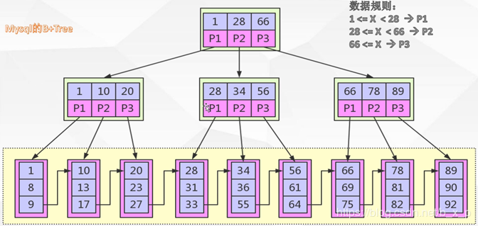

#事物
## ACID
 Atomicity   元子性：一个事物必须视为一个不可分割的最小工作单元，事物中的所有操作要么同时成功要么同时失败
 Consistency 一致性
 Isolation   隔离性：
 Durability  持久性：一旦事物提交，则其所做的修改就会永久保存到数据库中。
 
 ## 隔离级别
  READ UNCOMMITTED (未提交读)
  READ COMMITED （提交读）
  REPEATABLE READ（可重复读）
  SERIALIZABLE（串行读）
  
 ## 脏读，幻读，不可重复读
  ### 脏读
   脏读是指在一个事物中读取到了另一个事物尚未提交到数据。
 ### 幻读
   幻读是指同一个事务内多次查询返回的结果集不一样，主要针对insert
 ### 不可重复读
   不可重复读是指在一个事务内根据同一个条件对行记录进行多次查询，但是搜出来的结果却不一致;主要针对delete, update 
 
 ## MVCC 多版本并发控制
  InnoDB的MVCC 是通过在每行记录后面保存两个隐藏的列来实现的。这两列分别保存了行的创建时间和行的过期时间（或删除时间）。
  当然存储的不是实际的时间值而是系统版本号。每开始一个新事物，系统版本号都会递增。
 ### insert
     记录的版本号即当前事务的版本号
  |id|value|create_version|delete_version|
  |:---:|:---:|:---:|:---:|
  |1|1|1||
### update
     在更新操作的时候，采用的是先标记旧的那行记录为已删除，并且删除版本号是事务版本号，
     然后插入一行新的记录的方式
   |id|value|create_version|delete_version|
   |:---:|:---:|:---:|:---:|
   |1|1|1|2|
   |1|2|2  
### delete
    删除时将当前事物的系统版本号作为删除版本号
   |id|value|create_version|delete_version|
   |:---:|:---:|:---:|:---:|
   |1|2|2|3|  
 ### select
   InnoDB会根据以下两个条件检查每行记录：
   1. InnoDB 只查找版本号小于或等于事物的系统版本号，这样可以确保事物读取到的行要么是在事物开启前已经存在的，要么是
   事物本身插入或修改过的
   2. 行的删除版本号要么未定义，要么大于当前事物版本号，这样可以确保事物读取到的行在事物开始之前未被删除
# 索引
## 索引分类
  + 从存储结构上可以分为：B-Tree,B+Tree,Hash索引，全文索引，T-Tree, R-Tree
  + 从应用层次可以分为：普通索引,唯一索引，符合索引
## B+Tree  
B+Tree是在B-Tree基础上的一种优化，使其更适合实现外存储索引结构，InnoDB存储引擎就是用B+Tree实现其索引结构

B+Tree相对于B-Tree有几点不同：
1. 非叶子节点只存储键值信息。
2. 所有叶子节点之间都有一个链指针。
3. 数据记录都存放在叶子节点中

  
  
## 哈希索引
  哈希索引（Hash Index)基于哈希表实现，只能精确匹配索引所有列才能有效。对于每一行数据，存储引擎都会对所有索引
  列计算哈希值，哈希索引将所有哈希值保存在哈希表中，同时哈希表中保存指向数据行对指针
### 哈希索引限制
   1. 哈希索引只包含哈希值和行指针，而不存储字段，所以不能使用索引中对值来避免读取行
   2. 哈希索引数据并不是按索引值顺序存储的，所以无法使用排序
   3. 哈希索引不支持部分索引列匹配查找
   4. 哈希索引只支持等值查询
   5. 如果哈希冲突很多的话，一些索引维护代价也会很高
   
   InnoDB引擎有一个特殊功能叫做自适用索引(adaptive hash index) 当InnoDB 发现某些索引值被非常频繁
   使用时，它会在B+Tree 索引之上再创建一个哈希索引，这样就让B+Tree索引也具有哈希索引的一些优点。
## R-Tree

## 全文索引
       
  