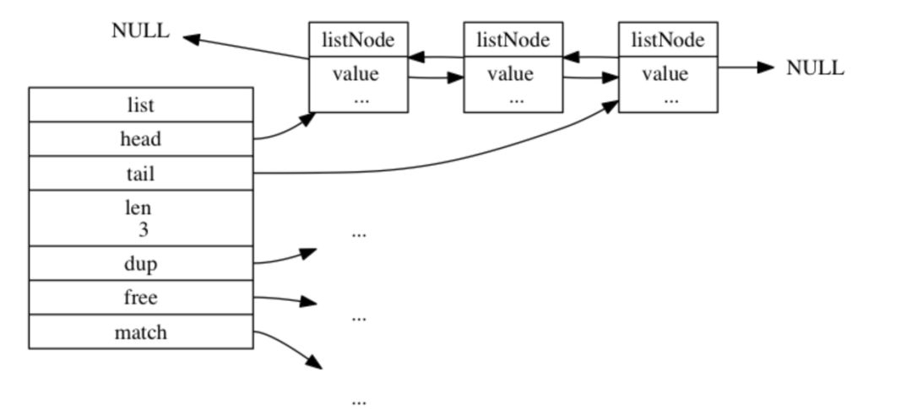

# Redis数据结构

## 字符串
  Redis自己构建了一种名叫Simple Dynamic String(SDS)的数据结构
  ```C
   struct sdshdr{
     //记录buf数据中已使用字节数量，等于SDS长度
     int len;
    //记录 buf中未使用字节数量
    int free;
    //字节数组，用于保存字符串
   char buf[];
} 
 ```
 它的优点主要有：
 + 开发者不用担心字符串变更造成内存溢出
 + 常数时间复杂度获取字符串长度
 + 空间预分配free，会默认留够一定的空间防止多次重新分配内存
 
 ## 链表
  Redis的链表在双向链表上扩展链头节点，未节点，元数据等属性。
  
  ```c
     typedef struct listNode{
       //前驱节点
       struct ListNode *prev;
      //后继节点
      struct ListNode *next;
      //节点的值
      void *value;  
      
     }


   typeof struct list{
     //头节点
     ListNOde *head;
     //未节点
     ListNode *tail;
     //链表中所包含节点数量
     unsigned long len;
   
   }
  ```
 
  链表的几个特点：
   + 可以直接获取表头节点，表尾节点。
   + 常数时间复杂度获取链表长度
   + 双向链表
   
## 字典（Hash)
  Redis的Hash就是在数组+链表的基础上进行一些rehash优化
  
 ```C
    typedef struct dictht{
  //哈希表数组
   dictEntry **table;
  //哈希表大小
  unsigned long size;
  //哈希表大小掩码，用于计算索引值，总是等于size-1
  unsigned long sizemask;
 // 哈希表已有节点数量
   unsigned long used;
}

typedef struct dictEntry {
    // 键
    void *key;
    // 值
    union {
        void *val;
        uint64_t u64;
        int64_t s64;
    } v;
    // 指向下个哈希表节点，形成链表
    struct dictEntry *next;  // 单链表结构
} 

typedef struct dict {
    // 类型特定函数
    dictType *type;
    // 私有数据
    void *privdata;
    // 哈希表
    dictht ht[2];
    // rehash 索引
    // 当 rehash 不在进行时，值为 -1
    int rehashidx; /* rehashing not in progress if rehashidx == -1 */
} dict;
```

### 当哈希表的键对太多或者太少，就需要对哈希表的大小进行调整，redis是如何调整的呢？

1. 我们仔细可以看到dict结构里有个字段dictht ht[2]代表有两个dictht数组。第一步就是为ht[1]哈希表分配空间，大小取决于ht[0]当前使用的情况。
2. 将保存在ht[0]中的数据rehash(重新计算哈希值)到ht[1]上。
3. 当ht[0]中所有键值对都迁移到ht[1]后，释放ht[0]，将ht[1]设置为ht[0]，并ht[1]初始化，为下一次rehash做准备。
### 渐进式rehash
这就涉及到了渐进式rehash，redis考虑到大量数据迁移带来的cpu繁忙(可能导致一段时间内停止服务)，所以采用了渐进式rehash的方案。步骤如下：
1. 为ht[1]分配空间，同时持有两个哈希表(一个空表、一个有数据)。
2. 维持一个技术器rehashidx，初始值0。
3. 每次对字典增删改查，会顺带将ht[0]中的数据迁移到ht[1],rehashidx++(注意：ht[0]中的数据是只减不增的)。
4. 直到rehash操作完成，rehashidx值设为-1。