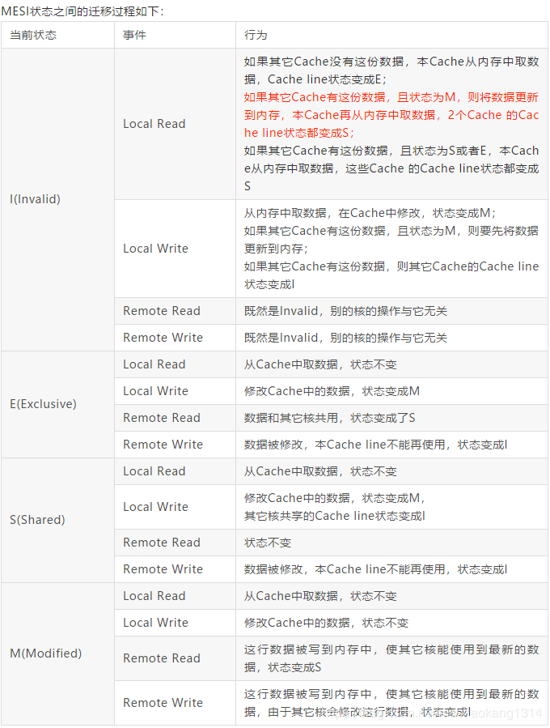

#MESI
  在多核CPU中，内存中数据在每个核心都会存在数据副本，某一个核心发生修改操作就会导致数据不一致；而一致性协议
  正是保证多个CPU cache之间缓存共享数据都一致性。
  
 ## cache Line
  cache Line 是 CPU cache与内存数据交换的最小单元，根据操作系统不同一般是32 byte或64byte
 ## MESI 
 MESI 协议将缓存行的状态分为Modify(修改),Exclusive(独占),Shared(共享),Invalid(失效)
 
 |状态|描述|
 |:---|:--------| 
 |M(modify)|当前CPU刚刚修改完数据状态，当前CPU拥有最新数据，其他CPU拥有失效数据，而且和主内存数据不一致|
 |E(exclusive)|只有当前CPU拥有数据，其他CPU中没有该数据，当前CPU数据和主内存数据是一致的|
 |S(Shared)|当前CPU和其他CPU拥有相同数据，且和主内存数据一致|
 |I(Invalid)|当前CPU中的数据失效，数据应该从主存中获取，其他CPU中可能有数据也可能无数据；当前CPU中的数据和主存中的数据被认为不一致。|
 
 ##MESI协议状态迁移
在MESI协议中，每个Cache控制器不仅知道自己的读写操作，而且也监听其他Cache的读写操作，每个Cache line所处的状态根据本核和其他核的读写操作在4个状态之间进行迁移
分为以下四个操作
1. Local Read
2. Local Write
3. Remote Read
4. Removte Write

  
  
  Volatile是如何保证可见性的？
  加入volatile关键字时，会多出一个lock前缀指令，lock前缀指令实际上相当于一个内存屏障，它有三个功能：
  + 确保指令重排序时不会把其后面的指令重排到内存屏障之前的位置，也不会把前面的指令排到内存屏障后面，即在执行到内存屏障这句指令时，前面的操作已经全部完成；
  + 将当前处理器缓存行的数据立即写回系统内存（由volatile先行发生原则保证）；
  + 这个写回内存的操作会引起在其他CPU里缓存了该内存地址的数据无效。写回操作时要经过总线传播数据，而每个处理器通过嗅探在总线上传播的数据来检查自己缓存的值是不是过期了，当处理器发现自己缓存行对应的内存地址被修改，就会将当前处理器的缓存行设置为无效状态，当处理器要对这个值进行修改的时候，会强制重新从系统内存里把数据读到处理器缓存(也是由volatile先行发生原则保证)；

缓存一致性协议有多种，但是日常处理的大多数计算机设备都属于”嗅探（snooping）”协议，它的基本思想是：
所有内存的传输都发生在一条共享的总线上，而所有的处理器都能看到这条总线：缓存本身是独立的，但是内存是共享资源，所有的内存访问都要经过仲裁（同一个指令周期中，只有一个CPU缓存可以读写内存）。
CPU缓存不仅仅在做内存传输的时候才与总线打交道，而是不停在嗅探总线上发生的数据交换，跟踪其他缓存在做什么。所以当一个缓存代表它所属的处理器去读写内存时，其它处理器都会得到通知，它们以此来使自己的缓存保持同步。只要某个处理器一写内存，其它处理器马上知道这块内存在它们的缓存段中已失效。
